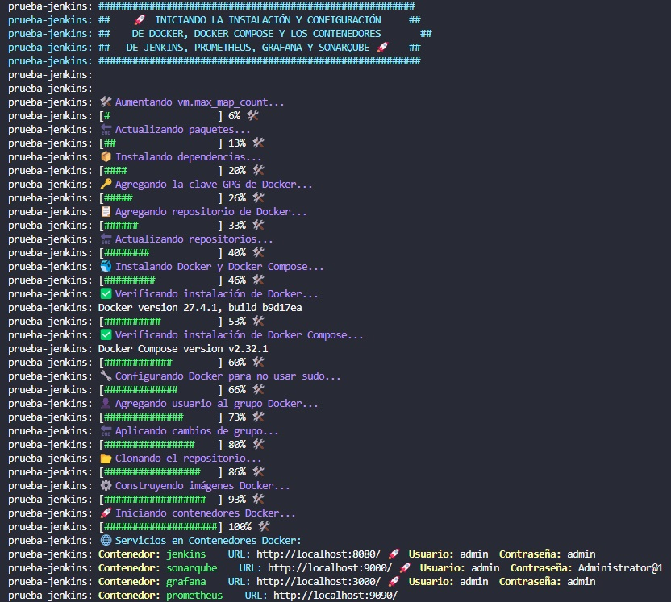

# Jenkins, Prometheus, Grafana y SonarQube con Vagrant y Docker

Este repositorio automatiza la instalación y configuración de herramientas esenciales para la integración continua y monitoreo, utilizando **Vagrant**, **Docker**, y **Docker Compose**.

## 💻 Requisitos Previos

Antes de comenzar, asegúrate de tener instaladas las siguientes herramientas en tu máquina:

- [Vagrant](https://www.vagrantup.com/)
- [VirtualBox](https://www.virtualbox.org/)
- [Git](https://git-scm.com/)

## 🚀 Instrucciones de Uso

### 1. Clonar el Repositorio
Clona este repositorio en tu máquina local:
```bash
git clone https://github.com/NicolasBatistelli/jenkins-prometheus-grafana-sonarqube.git
cd jenkins-prometheus-grafana-sonarqube
```

### 2. Iniciar la Máquina Virtual con Vagrant
Navega al directorio `Vagrant` y ejecuta:
```bash
vagrant up
```

Este comando iniciará una máquina virtual y configurará automáticamente las siguientes herramientas dentro de contenedores Docker:

- **Jenkins**: [http://localhost:8080](http://localhost:8080)
- **SonarQube**: [http://localhost:9000](http://localhost:9000)
- **Grafana**: [http://localhost:3000](http://localhost:3000)
- **Prometheus**: [http://localhost:9090](http://localhost:9090)

### 3. Conexión SSH
Para conectarte a la máquina virtual:
```bash
vagrant ssh
```

### 4. Detener la Máquina Virtual
Cuando termines, puedes detener la máquina virtual ejecutando:
```bash
vagrant halt
```

### 5. Destruir la Máquina Virtual
Si deseas eliminar completamente la máquina virtual:
```bash
vagrant destroy
```

---

## 🛠️ Proceso Automático de Configuración

Al ejecutar `vagrant up`, se realizará automáticamente lo siguiente:

1. **Ajuste de parámetros del sistema:**
   - Configuración de `vm.max_map_count`.

2. **Instalación de Dependencias:**
   - Actualización de paquetes del sistema.
   - Instalación de Docker y Docker Compose.
   - Configuración de Docker para evitar el uso de `sudo`.

3. **Clonación del Repositorio:**
   - El código fuente se clona en la máquina virtual.

4. **Construcción y Ejecución de Contenedores:**
   - Construcción de imágenes Docker.
   - Inicio de los contenedores con los servicios configurados.

### 🖼️ Ejemplo del Proceso:
Al ejecutar `vagrant up`, verás el sigiuente progreso de instalación:

<p align="left">
  
</p>

## 📝 Acceso a Jenkins:

El acceso a Jenkins se puede hacer directamente en http://localhost:8080

El usuario y la contraseña por defecto son:

- **Usuario**: admin
- **Contraseña**: admin

## 🔑 Acceso a SonarQube:

El acceso a SonarQube se puede hacer directamente en http://localhost:9000

El usuario y la contraseña por defecto son:

- **Usuario**: admin
- **Contraseña**: Adm1nistr@tor

## 📊 Acceso a Grafana:

Puedes acceder a Grafana en http://localhost:3000

El usuario y la contraseña por defecto son:

- **Usuario**: admin
- **Contraseña**: admin

## 📈 Acceso a Prometheus:

Puedes acceder a Prometheus en http://localhost:9090

## 🐳 Ejecutar Solo con Docker:

1.🌐 **Crear una Red Docker**
- Este paso es opcional pero recomendable si necesitas una red personalizada para los contenedores. Puedes crear una red llamada back-tier con el siguiente comando:

```bash
docker network create back-tier || true
```
Este comando creará la red back-tier si no existe. Si ya está creada, el || true evitará errores y continuará ejecutándose.

2.⚙️  **Construir las Imágenes Docker**
- A continuación, construye las imágenes de Docker. Esto descargará las últimas versiones de las dependencias y las construirá sin usar imágenes de caché:
```bash
docker compose build --pull --no-cache
```
Este comando construirá las imágenes de todos los servicios definidos en el archivo docker-compose.yml.

3.🚀 **Iniciar los Contenedores en Segundo Plano**
- Una vez que las imágenes estén construidas, puedes iniciar los contenedores en segundo plano ejecutando:
```bash
docker compose up -d
```
Esto levantará los contenedores definidos en docker-compose.yml en modo "desprendido" (detached), lo que significa que seguirán ejecutándose en segundo plano.

4.✅ **Verificar los Contenedores en Ejecución**
- Para verificar que los contenedores estén funcionando correctamente, puedes usar:
```bash
docker ps
```

5.🛑 **Detener los Contenedores**
- Si deseas detener los contenedores, puedes usar el siguiente comando:
```bash
docker compose down -v
```


## 📃 Estructura del Proyecto

```
├── Vagrant/
├── jenkins/
├── prometheus/
├── grafana/
├── sonarqube/
├── app-java/
├── docker-compose.yml
└── README.md
```

---

## 🚜 Solución de Problemas Comunes

### Error de Recursos Insuficientes
Asegúrate de tener al menos 4 GB de RAM y suficiente espacio en disco para la máquina virtual.

### Docker No Inicia
Verifica que Docker esté correctamente instalado en la máquina virtual y que el servicio esté en ejecución.

---

## 🔧 Personalización

Puedes ajustar los puertos, credenciales y volúmenes editando los archivos de configuración en el directorio `Vagrant` o `docker-compose.yml`.

---

## 🎨 Carpeta `app-java`

La carpeta `app-java` contiene una API de ejemplo con un archivo `Jenkinsfile` configurado. Esta API fue utilizada como demo para verificar que la configuración de Jenkins funciona correctamente en este entorno.

---

## 📄 Documentación Adicional

Para guías detalladas sobre cómo:

Generar un token en SonarQube.

Generar un token en Gmail.

Configurar el plugin Email-Ext con el token de Gmail.

Configurar SonarQube con su token.

Consulta la siguiente documentación: [Guía de configuración detallada (PDF)](https://drive.google.com/file/d/1iG5BS__fIuH29-NILIwoYlh7KrTspCjV/view?usp=sharing)

---

## 📚 Más Información:

- **Docker**: [Visitar la documentación de Docker](https://docs.docker.com/)
- **Vagrant**: [Visitar la documentación de Vagrant](https://www.vagrantup.com/docs)
- **Prometheus**: [Visitar la documentación de Prometheus](https://prometheus.io/docs/)
- **Grafana**: [Visitar la documentación de Grafana](https://grafana.com/docs/)
- **SonarQube**: [Visitar la documentación de SonarQube](https://docs.sonarqube.org/latest/)
